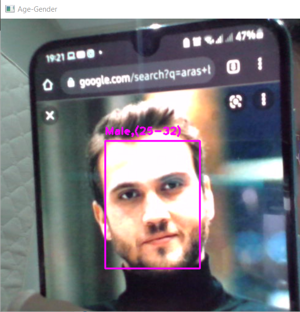
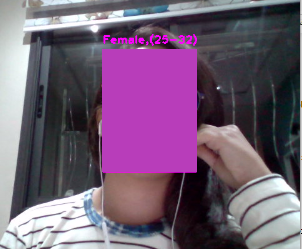

# Gender and Age Detection (Anaconda Version)

In this project, we are going to learn how detect
the gender and the age of a person or more using a webcam.

To do so, we need:
1. _**opencv_face_detector.pbtxt**_ 
2. **_opencv_face_detector_uint8.pb_**
3. **_age_deploy.prototxt_**
4. **_age_net.caffemodel_**
5. **_gender_deploy.prototxt_**
6. **_gender_net.caffemodel_**

        .pbtxt files are used to define model architecture
        .pb files are the binary type of .pbtxt files
        .caffemodel files containes the weights for the actual layers

Let's Begin :)
~~~python
import cv2 
~~~

## FACE DETECTION

~~~python
def faceBox(faceNet, frame):
    frameWidth = frame.shape[1]
    frameHeight = frame.shape[0]
    blob = cv2.dnn.blobFromImage(frame, 1.0, (227,227),[10,117,123],swapRB=False)
    faceNet.setInput(blob)
    detection = faceNet.forward()
    bboxs = []
    for i in range(detection.shape[2]): 
        confidence = detection[0,0,i,2]
        if confidence > 0.7 :
            x1 = int(detection[0,0,i,3]*frameWidth)
            y1 = int(detection[0,0,i,4]*frameHeight)
            x2 = int(detection[0,0,i,5]*frameWidth)
            y2 = int(detection[0,0,i,6]*frameHeight)
            bboxs.append([x1,y1,x2,y2])
            cv2.rectangle(frame, (x1,y1),(x2,y2),(255,0,255),2)
    return frame, bboxs
~~~

Let's explain every line and what is it for !

~~~python
    blob = cv2.dnn.blobFromImage(frame, 1.0, (227,227),[10,117,123],swapRB=False)
~~~

**"blobFromImage"** creates 4-dimensional blob from image. Optionally resizes and crops image from center, subtract mean values, 
scales values by scalefactor,
swap Blue and Red channels.
#####
The "cv2.dnn.blobFromImage" function returns a blob 
which is our input image after mean subtraction, 
normalizing, and channel swapping.

| Parameter      | Description | 
| :---        |    :----:   |    
| frame      |     This is the input image we want to preprocess before passing it through our deep neural network for classification.    | 
| 1.0 (scaleFactor) |After we perform mean subtraction we can optionally scale our images by some factor. This value defaults to `1.0` (i.e., no scaling) but we can supply another value as well.         | 
| (227,227) (size) |Here we supply the spatial size that the Convolutional Neural Network expects. For most current state-of-the-art neural networks this is either 224×224, 227×227, or 299×299.   | 
| [10,117,123] |These are our mean subtraction values. They can be a 3-tuple of the RGB means or they can be a single value in which case the supplied value is subtracted from every channel of the image.        | 
|swapRB=False| OpenCV assumes images are in `BGR` channel order; however, the `mean` value assumes we are using `RGB` order. To resolve this discrepancy we can swap the R and B channels in frame by setting this value to `True`. By default OpenCV performs this channel swapping for us.        | 
 ###
~~~python
faceNet.setInput(blob)
detection = faceNet.forward()
~~~
Pass the blob through the network and obtain the face detections

~~~python
 for i in range(detection.shape[2]): 
        confidence = detection[0,0,i,2]
        if confidence > 0.7 :
            x1 = int(detection[0,0,i,3]*frameWidth)
            y1 = int(detection[0,0,i,4]*frameHeight)
            x2 = int(detection[0,0,i,5]*frameWidth)
            y2 = int(detection[0,0,i,6]*frameHeight)
            bboxs.append([x1,y1,x2,y2])
            cv2.rectangle(frame, (x1,y1),(x2,y2),(255,0,255),2)
~~~

Here we loop over the detection, 
extract the confidence associates with the prediction, 
filter out weak detections by ensuring the confidence is 
greater than the minimum confidence `(0.7)` 
and then draw the bounding box of the face

## GENDER_AGE DETECTION

We started by initialising all the files that we are going use
~~~python
faceProto = "opencv_face_detector.pbtxt"
faceModel = "opencv_face_detector_uint8.pb"

ageProto = "age_deploy.prototxt"
ageModel = "age_net.caffemodel"

genderProto = "gender_deploy.prototxt"
genderModel = "gender_net.caffemodel"
~~~

Then we are going to load our serialized `face`, `age`and `gender`models 

~~~python
faceNet = cv2.dnn.readNet(faceModel, faceProto)
ageNet = cv2.dnn.readNet(ageModel, ageProto)
genderNet = cv2.dnn.readNet(genderModel, genderProto)
~~~

Initialise the lists that we need and precise that we will use the webcam 

~~~python
MODEL_MEAN_VALUES = (78.4263377603, 87.7689143744, 114.895847746)
ageList = ['(0-2)', '(4-6)', '(8-12)', '(15-20)', '(25-32)', '(38-43)', '(48-53)', '(60-100)']
genderList = ['Male', 'Female']

video=cv2.VideoCapture(0)
~~~
 As we can see this is the main loop that will help us to
 detect the age and gender of a person in a video 

~~~python
while True:
    ret, frame=video.read()
    frame, bboxs = faceBox(faceNet,frame)
    for bbox in bboxs :
        face = frame[bbox[1]:bbox[3], bbox[0]:bbox[2]]
        blob = cv2.dnn.blobFromImage(face, 1.0, (227,227), MODEL_MEAN_VALUES,swapRB=False)
        
        genderNet.setInput(blob)
        genderPred = genderNet.forward()
        gender = genderList[genderPred[0].argmax()]
        
        ageNet.setInput(blob)
        agePred = ageNet.forward()
        age = ageList[agePred[0].argmax()]
        
        label="{},{}".format(gender,age)
        cv2.putText(frame, label, (bbox[0], bbox[1]-10), cv2.FONT_HERSHEY_PLAIN, 1.2, (255,0,255),2)
        
        
    cv2.imshow("Age-Gender", frame)
    k=cv2.waitKey(1)
    if k == ord('q'): break
video.release()
cv2.destroyAllWindows()
~~~

"Frame" will get the next frame in the camera. "Ret" will obtain
return value from getting the camera frame, either true of false.
The "faceBox" will detect the face as we've seen previously

~~~python
ret, frame=video.read()
frame, bboxs = faceBox(faceNet,frame)
~~~

Pass the blob through the network and obtain the gender detection

~~~python
genderNet.setInput(blob)
genderPred = genderNet.forward()
gender = genderList[genderPred[0].argmax()]
~~~

Pass the blob through the network and obtain the age detection
~~~python
ageNet.setInput(blob)
agePred = ageNet.forward()
age = ageList[agePred[0].argmax()]
~~~
Label the Frame with the age and gender
~~~python
label="{},{}".format(gender,age)
cv2.putText(frame, label, (bbox[0], bbox[1]-10), cv2.FONT_HERSHEY_PLAIN, 1.2, (255,0,255),2)
~~~

Show the frame, wait till the key 'q' is pressed then quit and destroy all the windows
~~~python
    cv2.imshow("Age-Gender", frame)
    k=cv2.waitKey(1)
    if k == ord('q'): break
video.release()
cv2.destroyAllWindows()
~~~

## Here is the final results

